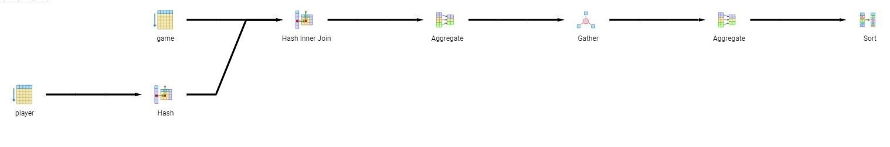
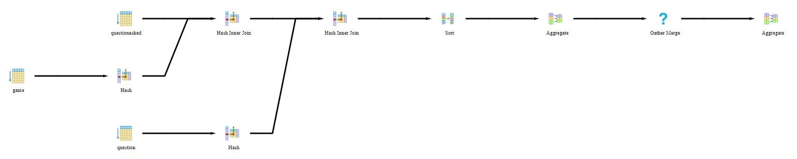
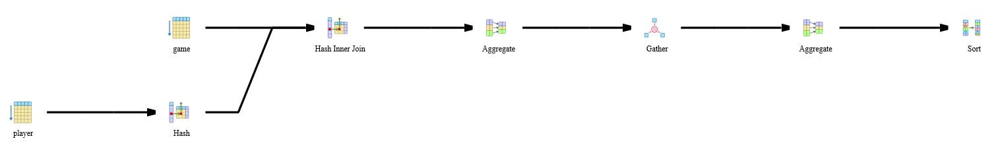
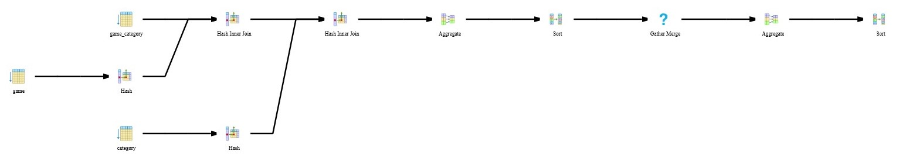

# Praktikum 5 - Explain der EclipseLink SQL Queries
Datenbanken 2 - Sommersemester 2019  
Gruppe: Fr2y-6  
750907 | Selim Sinan  
752940 | Ruben van Laack   

# Query 1
## EclipseLink SQL Query

    SELECT t0.ID, t0.NAME   
    FROM master_data_knowledge_test.player t0, master_data_knowledge_test.game t1    
    WHERE (((t1.STARTDATETIME >= '2019-06-16 16:55:03.0') AND (t1.ENDDATETIME >= '2019-06-16 16:55:23.0')) AND (t1.PLAYER_ID = t0.ID)) 
    GROUP BY t0.ID, t0.NAME 
    ORDER BY MAX(t1.STARTDATETIME) DESC, MAX(t1.ENDDATETIME) DESC;
*Start- und Enddatum eingesetzt*

## Explain Analyse

## Erklärung
Postgres durchläuft zunächst die gesamte "Player" Tabelle um einen Hash-Table der Player-IDs zu erstellen. 
Danach wird die "Game" Tabelle durchlaufen, dabei nach dem angegebenen Start- und Enddatum gefiltert und dann, mit einem Hash über den Player_ID-Fremdschlüssel, mit der Player Tabelle zusammengesetzt (join).
Beim Hash-Join werden also jedem Spieler aus der "Player" Tabelle die Spiele aus der nach Datum gefilterten "Game" Tabelle zugeordnet. 
Nur die Spieler welchen ein Spiel zugeordnet wird, werden aufgelistet (inner join).
In dem "Aggregate" Schritt werden die Spieler mit Spielen nach dem vorher erzeugten Hash der Player-ID gruppiert. 
Der nachfolgende "Gather" Schritt trennt die einzelnen Gruppen, um nachfolgende Schritte parallel für jede Gruppe in einem eigenen "Worker" durchzuführen.
In dem "Gather" Schritt werden daher parallel für jede Gruppe die Maxima der Start- und Enddaten gebildet.
Danach werden die einzelnen Gruppen, mit je einem Spieler und dessen aggregierten Spieldaten, über "Aggrigate" wieder anhand des Hash der Spieler-ID zusammengesetzt.
Schlussendlich wird die Ergebnisstabelle noch mit einem Quicksort nach Datum absteigend sortiert.

# Query 2
## EclipseLink SQL Query
    SELECT t0.ID, t0.ENDDATETIME, t0.MAXQUESTIONS, t0.STARTDATETIME, t0.PLAYER_ID, COUNT(t1.ID), SUM(CASE  WHEN (t2.SELECTEDANSWER = t1.CORRECTANSWER) THEN 1 ELSE 0 END) 
    FROM master_data_knowledge_test.game t0, master_data_knowledge_test.questionasked t2, master_data_knowledge_test.question t1 
    WHERE ((t0.PLAYER_ID = 1) AND ((t2.GAME_ID = t0.ID) AND (t2.QUESTION_ID = t1.ID))) 
    GROUP BY t0.ID, t0.ENDDATETIME, t0.MAXQUESTIONS, t0.STARTDATETIME, t0.PLAYER_ID 
    ORDER BY t0.ID ASC;
*'Player_ID = 1' eingesetzt*

## Explain Analyse

## Erklärung
Zunächst wird die "Game" Tabelle nach dem ausgewälten Spieler gefiltert und eine Hash-Tabelle über die Spiel-ID erstellt. 
Die "Questionasked" Tabelle wird nun über einen Hash für deren Spiel_ID Fremdschlüssel mit der Spiele Tabelle vereint. 
Die resultierende Tabelle wird nun wieder, über Hash-Werte für den Fragen_ID Fremdschlüssel, mit der gebildeten Hash-Tabelle der Fragen vereint.
Im nächsten Schritt werden die Zeilen nach der Spiele-ID aufsteigend sortiert.
Nun wird via "Aggregate" nach Spiele-ID Gruppiert und im "Gather Merge" werden die aggregierten Werte für jede Gruppe errechnet und die Gruppen zu je einer Zeile entsprechend dem Select zusammengefasst.
Danach werden über ein weiteres "Aggregate" noch die Gruppen zu einer Tabelle zusammengebaut.

<!-- Seitenumbruch -->

# Query 3
## EclipseLink SQL Query
    SELECT t0.ID, t0.NAME 
    FROM master_data_knowledge_test.player t0, master_data_knowledge_test.game t1 
    WHERE (t1.PLAYER_ID = t0.ID) 
    GROUP BY t0.ID, t0.NAME 
    ORDER BY COUNT(t1.ID) DESC;

## Explain Analyse

## Erklärung
- Scan und Erstellung einer Hash Tabelle für die Spieler Tabelle. 
- Zusammenführen der Spieler und Spiele Tabellen über den Hash der Spieler_ID.
- Zerteilung in Gruppen via "Aggregate" nach dem Spieler und Ermittlung der Spieleanzahl für jede Gruppe über "Gather".
- Zusammenfassung der Gruppen über "Aggregate".
- Absteigende Sortierung der Spieler nach der Anzahl an Spielen jedes Spielers in "Sort".

<!-- Seitenumbruch -->

# Query 4
## EclipseLink SQL Query
    SELECT t0.ID, t0.NAME 
    FROM master_data_knowledge_test.category t0, master_data_knowledge_test.game_category t2, master_data_knowledge_test.game t1 
    WHERE ((t2.categoryId = t0.ID) AND (t1.ID = t2.gameId)) 
    GROUP BY t0.ID 
    ORDER BY COUNT(t1.ID);

## Explain Analyse

## Erklärung
- Bildung einer Hash-Tabelle für die Spiele
- Danach wir die "Game_Category" Tabelle durchlaufen und je, via Hash des "Game_ID" Fremdschlüssels mit der Spiele-Hash-Tabelle vereinigt.
- Es wird eine Hash-Tabelle für die "Category" Tabelle erstellt und danach die bereits vereinigte Tabelle, über den Hash der "Category_ID", mit dieser Kategorie-Hash-Tabelle vereinigt.
- Die Gesamttabelle wird über "Aggregate" nach Kategorie zerteilt 
- Die Gruppen werden mittels "Sort" nach nach ihrer Kategorie aufsteigend sortiert.
- Über "Gather Merge" werden die Gruppen zu je einem Tupel (einer Spalte) verbunden.
- Über "Aggregate" werden die Gruppen wieder zu einer Tabelle vereinigt und danach über "Sort" nach Anzahl der Spiele jeder Kategorie sortiert.